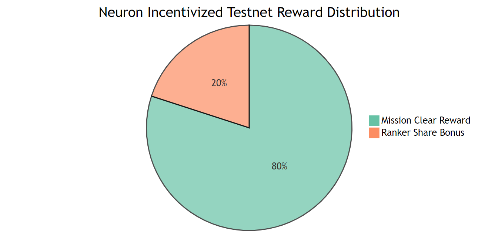
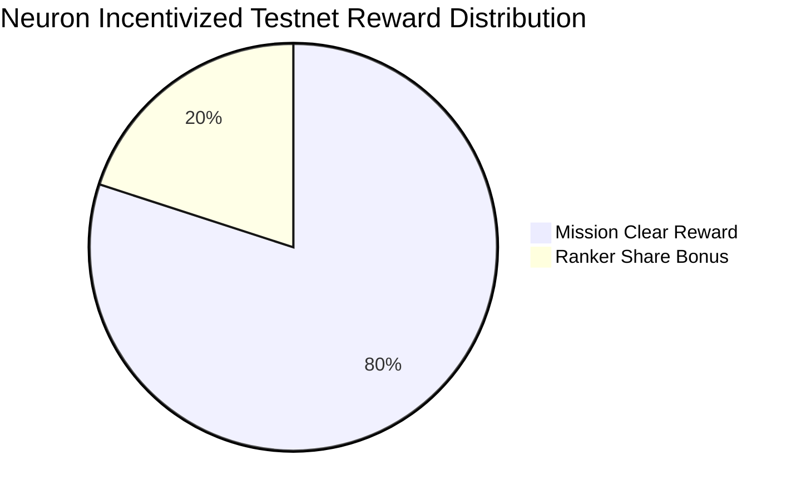
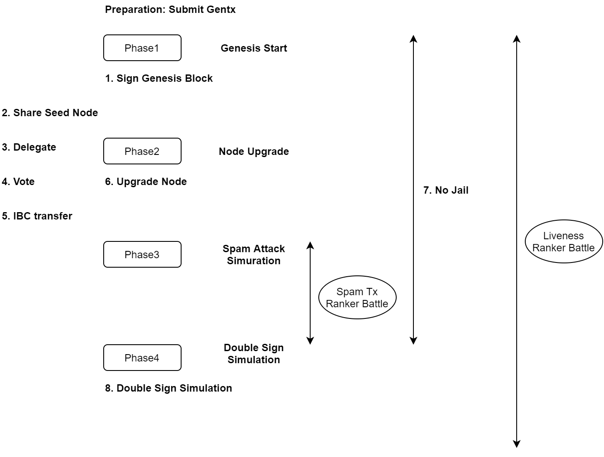

# Neuron Incentivized Testnet
Neuron Incentivized Testnet is the final 2 weeks testnet before mainnet launch for those who will join the mainnet. 1% of initial supply of $GAME will be distributed according to the level of achievement of missions and ranker battles. Also GAME Foundation will select a set of validators to delegate its GAME (15% of initial total supply) based on our assessment on the results of Neuron Incentivized Testnet.

## Rewards
1. Total amount of Rewards will be 2000000GAME which is the 1% of initial supply.
2. Rewards will be devided as Mission Clear Reward (80%) and Ranker Share Bonus (20%).
3. rewards will be distributed at the time of mainnet launch (as genesis state).
4. rewards will be distributed to the address which is registered in the application form.
3. GAME Foundation will select a set of validators to delegate its GAME based on the results of Neuron Incentivized Testnet (Detail about delegation program will be announced later).

  

<!---

-->

## Schedule
~~**Application Period**~~

Until October 17, 2021 11:00 GMT, participants are required to do the following things:

- ~~**[Submit Gentx](./gentx.md)**~~
- ~~**[Submit Form](https://forms.gle/BHgLRhmyrHoWzLj17)**~~

**Genesis Launch**

October 20, 2021 11:00 GMT

**Node Upgrade Event**

October 27, 2021 11:00 GMT

**Spam Tx Rank Battle Period**

October 28, 2021 11:00 GMT - October 31, 2021 11:00 GMT (3 days)

**Testnet End**

November 3, 2021 11:00 GMT

## Missions
80% of rewards will be distributed based on the total points you earned during testnet period.

|  No  |  Mission                | Point |Detail                           | Criteria |
| ---- | ----------------------- | ----- | ------------------------------- | --------------|
|  0   |  Submit Gentx           |   0   | Submit Gentx before the deadline. | This mission is absolute and must be completed on time. Follow [the instruction](./gentx.md) to submit gentx.
|  1   |  Sign Genesis Block     |  10   | Validator node should be up when starting genesis.| Those who succeed to commit  genesis block will be eligible.
|  2   |  Share P2P & RPC Node   |  10   | Add your P2P & RPC node info in [this hackmd](https://hackmd.io/y_JUOikHTvudW90oGySdWw). | Those who share info on valid RPC endpoint node will be eligible.
|  3   |  Delegate               |  10   | Broadcast delegate tx to at least once. | Those who succeed to send `delegate` tx will be eligible.
|  4   |  Vote                   |  10   | Broadcast vote tx at least 3 times. | Those who succeed to send `vote` tx at least 3 times will be eligible.
|  5   |  IBC Transfer           |  10   | Broadcast IBC Transfer tx at least once. | Those who succeed to send `IBC transfer` tx will be eligible.
|  6   |  Upgrade Node           |  10   | Upgrade Node to the specific version and send new tx. | Those who succeed to upgrade to the node with the tag `neuron-2` and send neuron module tx will be eligible.
|  7   |  No Jail                |  20   | Never jailed until from genesis to phase4 end. | Those who succeed to avoid being jailed until the end of Spam Tx Ranker Battle (October 31, 2021 11:00 GMT) will be eligible.
|  8   |  Double Sign Simulation |  20   | Sign twice in the same hieght block and get jailed intentionally. | After the end of Spam Tx Ranker Battle (October 31, 2021 11:00 GMT), Those who succeed to be jailed intentionally will be eligible. After the chain halt, validators can not be slashed by the double sign. So validators with the first 33% of voting power can be slashed and complete this mission.

In the mission No.3/No.4/No.5/No.6, the signer must be the address registered in the application form.

**Rewards Levels**: According to the percentage of achievement of tasks, there will be three reward levels:

| Total Points |  Reward coefficient |
| ------------ | ------------------- |
| 80+ (Gold)   |         1           |
| 70+ (Silver) |        0.8          |
| 60+ (Bronze) |        0.6          |

Indivisual Mission Clear Reward will be caliculated with the fomula below.

**MissionClearRewardPool = 200000000 * 0.01 * 0.8**

<!---
\begin{align*}
Mission Clear Reward = Mission Clear Reward Pool * \frac{My Level Reward Coefficient}{Number Of Gold Level * 1.0 + Number Of Silver Level * 0.8 + Number Of Blonze Level * 0.6}
\end{align*}

html source: https://www.codecogs.com/latex/eqneditor.php
-->

## Ranker Battles
20% of rewards will be distributed based on the Liveness Ranker Battle and Spam Tx Ranker Battle.

### Liveness Ranker Battle
 The main objective for the Liveness Ranker Battle is liveness, and each participant's rewards will depend on their ability to keep a connection alive. Participants will compete with jailed count and missed block count in the whole period (October 20, 2021 11:00 GMT - November 3, 2021 11:00 GMT). The winner will be the participant with the least number of jailed count and the least number of missed blocks. The jailed count has priority over the missed block count. The top 10 winners will receive prizes as follows.

| Rank |  Reward ($GAME) |
| ---- | --------------- |
|  1   |  50000          |
|  2   |  40000          |
|  3   |  30000          |
|  4   |  20000          |
|  5   |  10000          |
|  6   |  10000          |
|  7   |  10000          |
|  8   |  10000          |
|  9   |  10000          |
|  10  |  10000          |

### Spam Tx Ranker Battle

The main objective for the Spam Tx Ranker Battle is to stress test for the neuron network, and the winner will be the participant with the most tx posted in the Spam Tx Ranker Battle Period ( October 28, 2021 11:00 GMT - October 31, 2021 11:00 GMT). Participants must post txs from their address which is registered in the application form. Failed Tx will not be eligible to be counted. The top 10 winners will receive prizes as follows.

| Rank |  Reward ($GAME) |
| ---- | --------------- |
|  1   |  50000          |
|  2   |  40000          |
|  3   |  30000          |
|  4   |  20000          |
|  5   |  10000          |
|  6   |  10000          |
|  7   |  10000          |
|  8   |  10000          |
|  9   |  10000          |
|  10  |  10000          |

## Mission and Ranker Battle Flow

### All Phase
- [Delegate](#missions)
- [Vote](#missions)
- [IBC transfer](#missions)
- **[Liveness Ranker Battle](#ranker-battles)**

### Phase1
- [Sign Genesis Block](#missions)
### Phase2
- [Upgrade Node](#missions)
- [Share RPC & P2P Node](#missions)(before Phase 3)
### Phase3
- **[Spam Tx Ranker Battle](#spam-tx-ranker-battle)**
### Phase1~Phase3
- [No Jail](#missions)
### Phase4
- [Double Sign Simulation](#missions)

  

## Qualification
Any community members of GAME can participate in Neuron Incentivized Testnet, but the following conditions must be met to be eligible for the testnet rewards:

- The GitHub account has to be at least one month old
- One Team should submit one gentx (a sybil attack on the registration process is prohibited)
- Submit [the application form](https://forms.gle/BHgLRhmyrHoWzLj17) before the deadline

Participants who are found violating any of the rules, such as creating fake accounts for rewards or conducting any malicious behaviors, will be disqualified.

GAME team reserves all rights for the final interpretation.
