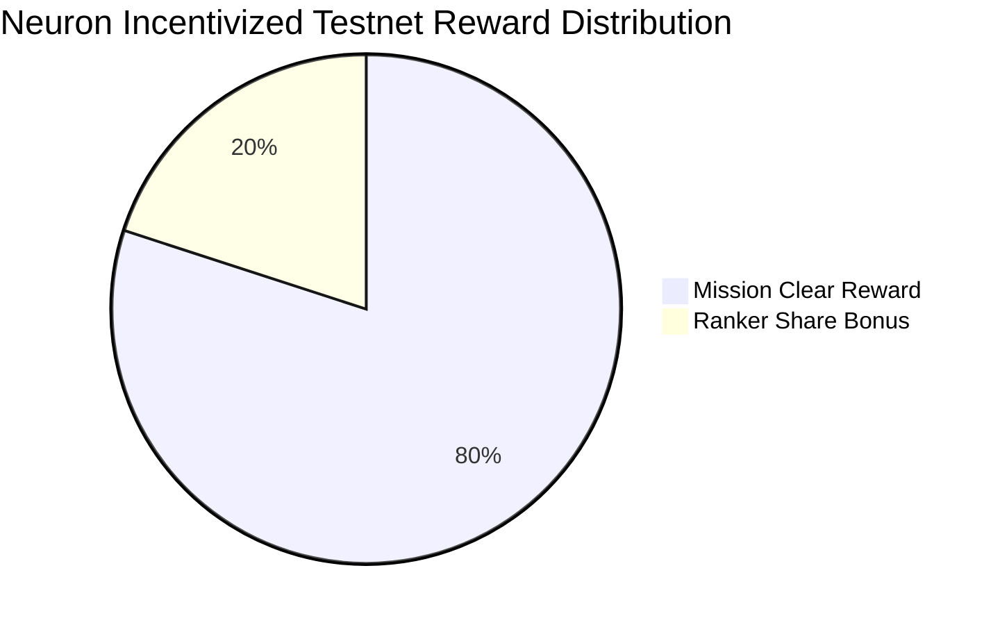

# Neuron Incentivized Testnet
Neuron Incentivized Testnet is the final testnet before mainnet launch for those who will join the mainnet. 1% of initial supply of $GAME will be distributed according to the level of achievement of missions and ranker battles.

  

<!---

-->

## Missions
80% of reward will be distributed based on the total points you earned during testnet period.

|  No  |  Mission                | Point |Detail                           |
| ---- | ----------------------- | ----- | -------------------------- |
|  0   |  Submit Gentx           |   0   | Submit Gentx before the deadline (mandatory). |
|  1   |  Sign Genesis Block     |  10   | Validator node should be up when starting genesis.
|  2   |  Share Seed Node        |  10   | Add your seed node info in [this hackmd](https://hackmd.io/y_JUOikHTvudW90oGySdWw).
|  3   |  Delegate               |  10   | Broadcast delegate tx to at least once.
|  4   |  Vote                   |  10   | Broadcast vote tx at least 3 times.
|  5   |  IBC Transfer           |  10   | Broadcast IBC Transfer tx at least once.
|  6   |  Upgrade Node           |  10   | Upgrade Node to the specific version and send new tx.
|  7   |  No Jail                |  20   | Never jailed until from genesis to phase4 end.
|  8   |  Double Sign Simulation |  20   | Sign twice in the same hieght block and get jailed intentionally.

**Rewards Levels**: According to the percentage of achievement of tasks, there will be three reward levels:

| Total Points |  Reward coefficient |
| ------------ | ------------------- |
| 80+ (Gold)   |         1           |
| 70+ (Silver) |        0.8          |
| 60+ (Bronze) |        0.6          |

Indivisual Mission Clear Reward will be caliculated with the fomula below.

**MissionClearRewardPool = 200000000 * 0.01 * 0.8**

<!---
\begin{align*}
Mission Clear Reward = Mission Clear Reward Pool * \frac{My Level Reward Coefficient}{Number Of Gold Level * 1.0 + Number Of Silver Level * 0.8 + Number Of Blonze Level * 0.6}
\end{align*}

html source: https://www.codecogs.com/latex/eqneditor.php
-->

## Ranker Battles
20% of reward will be distributed based on the Liveness Ranker Battle and Spam Tx Ranker Battle.

### Liveness Ranker Battle

| Rank |  Reward ($GAME) |
| ---- | --------------- |
|  1   |  50000          |
|  2   |  40000          |
|  3   |  30000          |
|  4   |  20000          |
|  5   |  10000          |
|  6   |  10000          |
|  7   |  10000          |
|  8   |  10000          |
|  9   |  10000          |
|  10  |  10000          |

### Spam Tx Ranker Battle

| Rank |  Reward ($GAME) |
| ---- | --------------- |
|  1   |  50000          |
|  2   |  40000          |
|  3   |  30000          |
|  4   |  20000          |
|  5   |  10000          |
|  6   |  10000          |
|  7   |  10000          |
|  8   |  10000          |
|  9   |  10000          |
|  10  |  10000          |

## Flow

### All Phase
- [Share Seed Node](#missions)
- [Delegate](#missions)
- [Vote](#missions)
- [IBC transfer](#missions)
- **[Liveness Ranker Battle](#ranker-battles)**

### Phase1
- [Sign Genesis Block](#missions)
### Phase2
- [Upgrade Node](#missions)
### Phase1~Phase3
- [No Jail](#missions)
- **[Spam Tx Ranker Battle](#spam-tx-ranker-battle)**
### Phase4
- [Double Sign Simulation](#missions)

  

## Qualification
Any community members of GAME can participate in Neuron Incentivized Testnet, but the following conditions must be met to be eligible for the testnet rewards:

- The GitHub account has to be at least one month old
- One Team should submit one gentx (a sybil attack on the registration process is prohibited)
- Submit registration form before the deadline

Participants who are found violating any of the rules, such as creating fake accounts for rewards or conducting any malicious behaviors, will be disqualified.

GAME team reserves all rights for the final interpretation.
